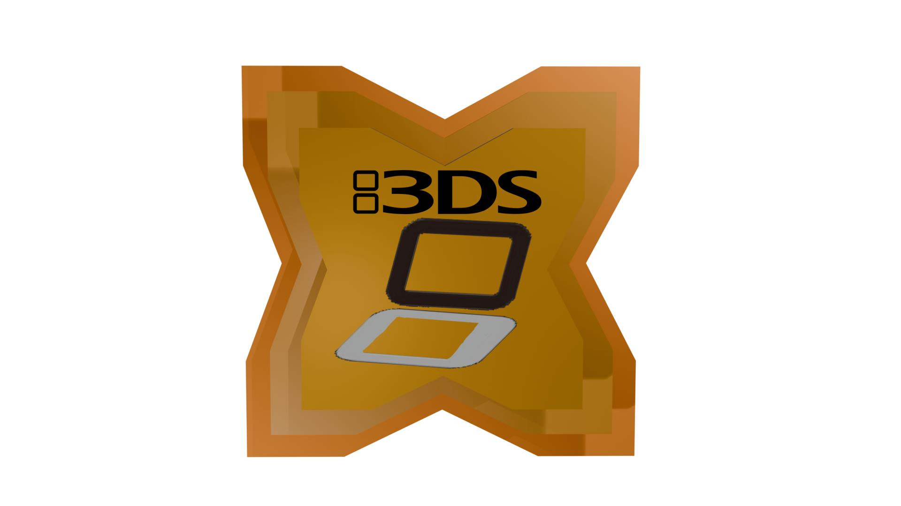

  

<small>Logo by *[avie](https://github.com/h3ath3rr)*</small>

Transpile and then Compile Haxe Code to 3DS Applications (3dsx, cia, any!) with easy documentation and some nifty useful tools (and too many services).

The goal is to implement every single LibCTRU

# How does it work?

This make uses of [reflaxe](https://github.com/SomeRanDev/reflaxe) and [reflaxe.cpp](https://github.com/SomeRanDev/reflaxe.CPP) which can read and compile haxe code to c++ outputted code so that the compiler can understand and compile to 3dsx! This was done with lots of love (and rage) to make this program so i hope i can get some support.

By the way, it's suppose to make the 3ds homebrew easier, i'm not implementing all of them in the header file and just call it a day.

Note: Tested **ONLY** on Haxe 4.3.2, I'm not planning to support Haxe 5+ and never will.

# INSTALLATION:

[See this to find out on how to install.](https://github.com/NAEL2XD/Haxe3DS/wiki/Haxe3DS-Installation)

# Additional libraries:

- [CitroEngine](https://github.com/NAEL2XD/CitroEngine) - Make 3DS GUI Games easily.

# Credits:

- [avie](https://github.com/h3ath3rr) for the logo, thank you! <3 <3
- [DSHaxe](https://github.com/MochaIcedTea/DSHaxe) for some of the example reflaxe code.
- [reflaxe](https://github.com/SomeRanDev/reflaxe) and [reflaxe.CPP](https://github.com/SomeRanDev/reflaxe.CPP) for making this possible.
- [devkitPro](https://github.com/devkitPro/libctru) for making homebrew amazing (and for [libctru](https://github.com/devkitPro/libctru)).
- [HaxeCompileU](https://github.com/Slushi-Github/hxCompileU) for a really great wii u compiler that i got interested for it.
- [3DBrew](https://www.3dbrew.org/) for the amount of documentations done to this system!
- [Nintendo Homebrew](https://discord.gg/nintendohomebrew) for helping me with `FS.mountSaveData` and `FS.flushAndCommit`. Y'all are amazing <3